# Worbi — Platform Gereksinimleri Dokümanı (PRD)

**Versiyon:** v6.0  
**Hazırlayan:** Azoxia  
**Tarih:** Haziran 2025  
**Durum:** Aktif Geliştirme  
**Gizlilik:** Şirket İçi — Gizli

---

## Değişiklik Geçmişi

| Versiyon | Özet |
|----------|------|
| v1.0 | İlk taslak — temel platform tanımı |
| v2.0 | Mutual QR Check-in, WorkerPayout, CommissionReceivable state machine'leri |
| v3.0 | Geniş raporlama modülü, filtre altyapısı, export desteği |
| v4.0 | KYC opsiyonelleştirildi · Worker profili genişletildi (eğitim, deneyim, sertifika, referans, dil) |
| v5.0 | Group-based RBAC · `resource.action` permission modeli · Level-based önceliklendirme · Scope-aware üyelik |
| v5.1 | Tasarım sistemi eklendi |
| v6.0 | Email doğrulama ile aktivasyon · Multi-device session · Race condition analizleri ve çözümleri · pgvector semantic matching · Agentic personalized notification · CV destekli profil oluşturma |

---

## İçindekiler

1. [Yönetici Özeti](#1-yönetici-özeti)
2. [Problem Tanımı ve Pazar Analizi](#2-problem-tanımı-ve-pazar-analizi)
3. [Para Akışı ve Finansal Model](#3-para-akışı-ve-finansal-model)
4. [Kimlik, Yetki ve Oturum Mimarisi](#4-kimlik-yetki-ve-oturum-mimarisi)
5. [Fonksiyonel Gereksinimler](#5-fonksiyonel-gereksinimler)
6. [Race Condition Analizleri ve Çözümleri](#6-race-condition-analizleri-ve-çözümleri)
7. [Matching Engine](#7-matching-engine)
8. [Sistem Akış Diyagramları](#8-sistem-akış-diyagramları)
9. [State Machine'ler](#9-state-machineler)
10. [Fonksiyonel Olmayan Gereksinimler](#10-fonksiyonel-olmayan-gereksinimler)
11. [Sistem Mimarisi](#11-sistem-mimarisi)
12. [Domain Modeli](#12-domain-modeli)
13. [Raporlama Modülü](#13-raporlama-modülü)
14. [Geliştirme Yol Haritası](#14-geliştirme-yol-haritası)
15. [Riskler](#15-riskler)
16. [Başarı Metrikleri](#16-başarı-metrikleri)

---

## 1. Yönetici Özeti

Worbi, Kıbrıs'ta üniversite okuyan yabancı uyruklu öğrenciler ile otel, restoran ve benzeri işletmeleri **gerçek zamanlı olarak buluşturan, yevmiye tabanlı işgücü eşleştirme platformudur.**

Platform bir iş ilanı sitesi değildir. **Spot market** modelinde çalışır — Uber'in işgücü piyasasına uygulanmış halidir. İşlemler günlük vardiya bazlıdır ve gerçek zamanlı eşleştirme gerektirir.

Worbi, Azoxia'nın mevcut aracı operasyonunu dijitalleştirerek manuel süreçleri, kağıt/Excel tabanlı takibi ve nakit para akışını otomatik hale getirir. Azoxia bu pazarda halihazırda aktif aracı konumundadır — cold-start problemi baştan elimine edilmiştir.

### Temel Değer Önerileri

| Taraf | Kazanım |
|-------|---------|
| **Worker (Öğrenci)** | Şeffaf ilanlar, anlık eşleştirme, kişiselleştirilmiş bildirimler, CV destekli profil, ödeme takibi |
| **Employer (İşveren)** | Semantik arama ile filtrelenmiş profiller, QR devam takibi, dijital komisyon faturası, vardiya planlama |
| **Azoxia (Platform)** | Komisyon otomasyonu, ölçeklenebilir gelir, tam audit trail, fraud koruması, esnek yetki yönetimi |

### Hedef Kapasite

| Metrik | Başlangıç | Ölçek |
|--------|-----------|-------|
| İşveren | 1.000 | 5.000+ |
| Worker | 10.000 | 50.000+ |
| Günlük aktif vardiya | ~3.000 | ~15.000 |
| Aylık finansal işlem | ~90.000 | ~450.000+ |
| Coğrafya | Kıbrıs | Akdeniz ülkeleri |

---

## 2. Problem Tanımı ve Pazar Analizi

### 2.1 Mevcut Durum (As-Is)

| Aktör / Süreç | Mevcut Yöntem | Sorun |
|---------------|---------------|-------|
| Koordinasyon | Excel, kağıt, WhatsApp | Hata riski, ölçeklenemez |
| İşveren → Azoxia komisyon | Aylık nakit | Takip yok, gecikme riski |
| İşveren → Worker yevmiye | Nakit, elden | Kayıt dışı risk |
| Vardiya doğrulama | Güven bazlı | "Geldi/gelmedi" çözülemiyor |
| Komisyon takibi | Hesap makinesi + manuel | Hata, audit yok |
| Worker eşleştirme | Telefon / WhatsApp | Semantik uyum yok, "servis elemanı" ile "garson" eşleşmiyor |

### 2.2 Hedef Durum (To-Be)

- İşveren platform üzerinden ilan oluşturur, dijital komisyon faturası alır
- Öğrenci müsaitliğini girer, semantic matching ile uygun vardiyalara eşleşir
- Mutual QR ile check-in/out tamamlanır — insan müdahalesi olmadan doğrulama
- Komisyon otomatik hesaplanır, `CommissionReceivable` olarak kaydedilir
- İşverenin worker'a yaptığı ödeme `WorkerPayout` kaydıyla loglanır
- Yetki yönetimi statik enum'lardan değil, dinamik grup tanımlarından karşılanır

---

## 3. Para Akışı ve Finansal Model

Platform bir **ödeme aracısı değildir.** Worker'a yapılan ödeme işveren ile worker arasında gerçekleşir; platform loglar ve takip eder.

```
1. Worker    ──── vardiya hizmeti verir ────────────────► Employer
2. Employer  ──── yevmiye öder (kendi periyodunda) ─────► Worker     [WorkerPayout log]
3. Employer  ──── komisyon öder (aylık fatura) ─────────► Azoxia     [CommissionReceivable]
```

### Komisyon Hesaplama

| Değişken | Örnek |
|----------|-------|
| GrossWage | 1.000 TL |
| CommissionAmount (%15) | 150 TL |
| NetAmount (Worker) | 850 TL |

### Komisyon Kural Hiyerarşisi (Chain of Responsibility)

| Scope | Öncelik | Açıklama |
|-------|---------|----------|
| Global | 0 | Fallback — tüm atamalar |
| JobCategory | 1 | Kategori bazlı |
| Employer | 2 | İşveren bazlı |
| Worker | 3 | En yüksek — bireysel |

Kurallar `Type: Percentage | FixedAmount` olabilir. `ValidFrom` / `ValidUntil` ile geçerlilik süresi tanımlanabilir. Her hesaplama immutable `CommissionAuditLog`'a yazılır.

---

## 4. Kimlik, Yetki ve Oturum Mimarisi

### 4.1 Email Doğrulama ile Aktivasyon (v6.0)

v5.x'teki admin onayı zorunluluğu kaldırıldı. Worker aktivasyonu email doğrulaması ile gerçekleşir:

```
Kayıt → AccountStatus: Pending → Doğrulama emaili gönderilir
Email linki tıklanır → EmailVerifiedAt set edilir → AccountStatus: Active
```

**Token kuralları:**
- 24 saat geçerli
- Tek kullanımlık (SHA-256 hash DB'de, raw token emailde)
- Süresi dolmuşsa yeni token talep edilebilir
- Doğrulanmamış hesaplar 7 gün sonra otomatik silinir (scheduled job)

**`User` aggregate değişiklikleri:**

```csharp
public string?          EmailVerificationToken    { get; }  // SHA-256 hash
public DateTimeOffset?  EmailVerificationExpiresAt { get; }
public DateTimeOffset?  EmailVerifiedAt            { get; }

// Metotlar
void RequestEmailVerification(string tokenHash, DateTimeOffset expiresAt)
void VerifyEmail(string tokenHash)  // hash eşleşmeli + süre kontrolü
```

> **Not:** Employer aktivasyonu admin onayı gerektirmeye devam eder. Bu değişiklik yalnızca Worker flow'u etkiler.

### 4.2 Multi-Device Session (v6.0)

Bir kullanıcı N farklı cihazdan eş zamanlı giriş yapabilir. Her cihaz için ayrı `UserSession` kaydı tutulur.

**`UserSession` entity:**

```
Id               long
UserId           long           FK → User
DeviceId         string         Client'ın ürettiği UUID — SecureStorage'da saklanır
DeviceName       string         "iPhone 15 Pro", "Samsung Galaxy S24"
Platform         string         "iOS" | "Android" | "Web"
FcmToken         string         FCM push notification token — cihaz başına unique
RefreshTokenHash string         SHA-256 — raw değer DB'de yok
LastActiveAt     DateTimeOffset
CreatedAt        DateTimeOffset
IsActive         bool
```

**Davranışlar:**
- Login → mevcut `DeviceId` için session varsa güncelle, yoksa yeni oluştur
- Logout → yalnızca o cihazın session'ı revoke edilir
- "Tüm cihazlardan çıkış" → tüm session'lar revoke
- FCM bildirimi → `GetActiveFcmTokensAsync(userId)` ile tüm cihazlara multicast

### 4.3 Group-Based RBAC

Sabit `UserRole` enum'u yoktur. Tüm yetkilendirme dinamik grup tanımlarından karşılanır.

```
User → UserGroupMembership → UserGroup → GroupPermission → Permission
          (scope + aktiflik)    (level)    (Allow | Deny)   (resource.action)
```

**Çözümleme kuralları:**
1. Kullanıcının aktif grup üyelikleri toplanır (scope filtresi uygulanır)
2. Gruplar `Level`'a göre yüksekten küçüğe sıralanır
3. **Deny varsa → her zaman Forbidden** (level fark etmez)
4. En az bir Allow varsa → izin verilir
5. İkisi de yoksa → Forbidden

**Scope tipleri:**

| ScopeType | Anlam |
|-----------|-------|
| `Global` | Kısıtsız erişim |
| `EmployerScoped` | ScopeId = EmployerId |
| `LocationScoped` | ScopeId = LocationId |

**Sistem grupları (Migration ile seed edilir, silinemez `IsSystem=true`):**

| Grup | Level | Temel Yetkiler |
|------|-------|----------------|
| `platform-admin` | 100 | Tüm izinler |
| `finance-admin` | 80 | Finansal izinler |
| `employer-admin` | 60 | Employer scope |
| `shift-supervisor` | 40 | QR + check-in + payout |
| `worker` | 20 | Profil + başvuru + check-in + kazanç |

**Permission cache:**
- Redis key: `perm:{userId}`, TTL: 5 dakika
- Grup üyeliği değişince `INVALIDATE` tetiklenir

### 4.4 JWT Token Yapısı

- **Access token:** 15 dakika, RS256 (asymmetric key)
- **Refresh token:** 30 gün, SHA-256 hash `UserSession`'da saklanır
- **Claims:** `sub (userId)`, `jti`, `email`, `iat`, `exp`
- **Refresh token rotation:** kullanılan token geçersiz olur, yeni token çifti üretilir

---

## 5. Fonksiyonel Gereksinimler

### 5.1 Worker Kaydı ve Aktivasyonu

1. Worker email, şifre, ad, soyad, üniversite bilgileriyle kayıt olur
2. `AccountStatus: Pending` — platform kısıtlı erişim
3. Email doğrulama linki iletilir (24 saat geçerli, tek kullanımlık)
4. Link tıklanınca `AccountStatus: Active` — tam erişim

### 5.2 Worker Profili

Worker profili aşağıdaki bölümlerden oluşur:

| Bölüm | Entity | Açıklama |
|-------|--------|----------|
| Temel | `Worker` | Ad, soyad, uyruk, doğum tarihi, üniversite, öğrenci no |
| Skill Tags | `WorkerSkill` | Lowercase etiketler — matching'de kullanılır |
| Eğitim | `WorkerEducation` | Okul, bölüm, tür, yıl, devam ediyor mu |
| Deneyim | `WorkerExperience` | Şirket, pozisyon, tarih aralığı, açıklama |
| Sertifikalar | `WorkerCertificate` | Ad, kurum, tarih, credential ID, opsiyonel belge URL |
| Referanslar | `WorkerReference` | Ad, unvan, kurum, ilişki tipi, iletişim — maks. 5 |
| Diller | `WorkerLanguage` | ISO 639-1 kodu, seviye |
| Müsaitlik | `WorkerAvailability` | Haftalık gün + TimeSlot |
| Çalışma İzni | `WorkPermit` | Opsiyonel value object |
| Platform Stats | `Worker` | Rating, güvenilirlik skoru, toplam vardiya, toplam saat |
| **Skill Embedding** | `Worker` | `vector(1536)` — pgvector semantic search için |

### 5.3 CV Destekli Profil Oluşturma

Worker profili oluşturma sürecini hızlandırmak için CV upload ve AI extraction desteklenir.

**Desteklenen formatlar:** PDF, DOCX  
**Maksimum dosya boyutu:** 10 MB

**Pipeline:**

```
CV yüklenir → MinIO'ya kaydedilir → CvUploadSession: Uploaded
Background job başlar → CvUploadSession: Extracting
OpenAI GPT-4o ile içerik çıkarılır → CvUploadSession: AwaitingReview
Worker önizleme ekranında inceler (confidence badge'leri görünür)
Worker bölüm seçer ve onaylar → Worker profiline yazılır → CvUploadSession: Confirmed
```

**Çıkarılan alanlar:** Eğitim, deneyim, sertifikalar, diller, skill tags

**Confidence seviyeleri:**
- `High` — açık ve net → doğrudan gösterilir
- `Medium` — muhtemelen doğru → hafif vurgu
- `Low` — belirsiz → uyarı ikonu, worker onaylamalı

**ICvExtractionService (DI interface):**
```csharp
Task<CvExtractionResult> ExtractAsync(CvExtractionRequest request);
bool Supports(CvFileFormat format);
```

Varsayılan implementasyon: `OpenAiCvExtractionService` (GPT-4o, `json_object` response format, `temperature: 0`)

**Worker granüler seçim yapabilir:**
```csharp
record CvImportSelections(
    bool ApplyEducations   = true,
    bool ApplyExperiences  = true,
    bool ApplyCertificates = true,
    bool ApplyLanguages    = true,
    bool ApplySkills       = true);
```

### 5.4 İlan ve Vardiya Yönetimi

- Employer anlık veya planlanmış vardiya ilanı oluşturur
- `JobCategory` entity bazlı — admin panelinden runtime eklenebilir, deployment gerektirmez
- `JobPostingTemplate` — tekrarlayan vardiya şablonu, scheduler otomatik ilan açar
- `IsUrgent` flag — 2 saat kala genişletilmiş bildirim
- `description_embedding vector(1536)` — pgvector semantic search için

### 5.5 Mutual QR Check-in / Check-out

Doğrulama iki bağımsız tarafın aynı anda, aynı fiziksel mekânda olmasını zorunlu kılar.

**Doğrulama zinciri (her adım senkron):**

| Adım | Kontrol | Başarısız → |
|------|---------|-------------|
| 1 | Token Redis'te var mı? | `ExpiredToken` flag |
| 2 | TTL dolmadı mı? (clock drift toleransı: +5s) | `ExpiredToken` flag |
| 3 | Worker bu shift'e atanmış mı? | Hata — atama yok |
| 4 | GPS farkı ≤ 200m? | `AnomalyGracePeriod` akışı |
| 5 | Aynı anda başka aktif assignment var mı? | `DuplicateAssignment` flag |

**Clock Drift Çözümü:**

Sunucu timestamp'i QR token payload'ına gömülür. TTL kontrolü her zaman sunucu saati referansıyla yapılır, client saati güvenilmez:

```
token.ServerGeneratedAt + 60s + 5s(tolerans) > UtcNow → geçerli
```

**AnomalyGracePeriod (GPS için):**

```
GPS kontrolü başarısız → Hemen reddetme yok
  Attempt 1 → "Konumunuz doğrulanamadı, lütfen bekleyin..." (3-5s bekleme)
  Attempt 2 → Tekrar GPS alınır, kontrol tekrar edilir
  Attempt 3 → Başarısız → LocationMismatch flag set edilir

Redis key: qr_attempt:{tokenHash}:{workerId}, TTL: 30s
Atomik sayaç: INCR komutu
```

**Anomali Flagleri (`[Flags]` bitmask, powers of 2):**

| Flag | Değer | Tetikleyici |
|------|-------|-------------|
| `None` | 0 | Anomali yok |
| `LocationMismatch` | 1 | GPS farkı > 200m (3 deneme sonrası) |
| `ExpiredToken` | 2 | TTL + tolerans aşıldı |
| `ReplayAttack` | 4 | Aynı token ikinci kez → **otomatik Disputed** |
| `OutOfSchedule` | 8 | Vardiya saati dışı |
| `SuspiciousDuration` | 16 | Check-in/out arası < 30 dk |
| `DuplicateAssignment` | 32 | Aynı anda 2 aktif shift → **otomatik Disputed** |
| `BulkConfirm` | 64 | Tüm worker aynı saniyede onaylandı |
| `SupervisorOffsite` | 128 | Supervisor geofence dışında |

Hard violation (`ReplayAttack | DuplicateAssignment`) → Otomatik `Disputed`, payout dondurulur.

### 5.6 Komisyon Motoru

- Tip: `Percentage` (0–1 arası decimal, 0.15 = %15) veya `FixedAmount`
- `ValidFrom` / `ValidUntil` — zaman sınırlı kurallar
- `CommissionAuditLog` — immutable, append-only, DB trigger ile delete/update engellenir
- `AssignmentCompleted` event → `CommissionEngine.CalculateAsync()` → `WorkerPayout` oluştur + `CommissionReceivable` güncelle

### 5.7 Fatura Yönetimi (CommissionReceivable)

- Her ay 1'i gece 00:05 scheduled job çalışır
- Bir önceki ay tamamlanan tüm assignment'ları işveren bazında gruplar
- Her işveren için `CommissionReceivable` oluşturur, PDF üretir, `Invoiced` statüsüne geçirir
- Fatura numarası formatı: `WRB-YYYY-NNNN` (PostgreSQL sequence)
- Kısmi ödeme desteği: `PaidAmount < TotalCommission` → `PartiallyPaid`
- `DueDate + 3 gün` grace period → `Overdue` → admin alarmı

### 5.8 Worker Ödeme Takibi (WorkerPayout)

- Assignment tamamlanınca otomatik `Pending`
- Employer/Supervisor `payout.markpaid` → `Processing`
- Worker `payout.confirm` → `Paid`
- Worker 48 saat içinde teyit etmezse admin flag
- `RetryCount ≥ 3` → admin müdahale gerekir
- Payout, assignment `Disputed` iken `Processing`'e geçemez (pessimistic lock)

### 5.9 Bildirim Sistemi

| Kanal | Kullanım |
|-------|----------|
| Push (FCM Multicast) | Tüm aktif cihazlara — `GetActiveFcmTokensAsync(userId)` |
| SMS | Kritik: vardiya onayı, QR son uyarısı |
| Email | Komisyon faturası, email doğrulama, haftalık özet |
| In-App | Bildirim merkezi |

**Agentic Personalized Notification (v6.0):** Bkz. Bölüm 7.2

### 5.10 Admin Paneli

- `UserGroup` CRUD, permission matris yönetimi
- Worker email doğrulama durumu takibi
- Aktif session listesi — cihaz bazlı, zorla çıkış
- Komisyon kural yönetimi
- Canlı assignment + anomali kuyruğu
- Dispute çözüm akışı
- CommissionReceivable yönetimi, ödeme kaydı
- Raporlama paneli

---

## 6. Race Condition Analizleri ve Çözümleri

### 6.1 JobPosting FilledCount — Overbooking

**Senaryo:** Son 1 slot için 2 işveren aynı anda başvuru onaylıyor.

```
T1: SELECT filled_count=4, required_count=5 → slot var
T2: SELECT filled_count=4, required_count=5 → slot var
T1: UPDATE filled_count=5 ✓
T2: UPDATE filled_count=6 ✗ — OVERBOOKING
```

**Çözüm: Atomic UPDATE + RowVersion optimistic concurrency**

```sql
UPDATE job_postings
SET filled_count = filled_count + 1
WHERE id = @id
  AND filled_count < required_count
  AND status = 'Open'
RETURNING filled_count, required_count;
-- 0 satır etkilendiyse → slot doldu, BusinessRuleViolationException
```

- EF Core `RowVersion (uint)` concurrency token → `DbUpdateConcurrencyException` yakalanır
- Hata: worker'a "Bu pozisyon doldu" döner, `JobPosting.Status = Filled`

### 6.2 JobApplication — Duplicate Application

**Senaryo:** Worker aynı ilana iki kez aynı anda başvuruyor.

**Çözüm:** DB unique constraint

```sql
CREATE UNIQUE INDEX uq_application_pending
ON job_applications(job_posting_id, worker_id)
WHERE status = 'Pending';
```

Application layer'da `UniqueConstraintException` → `BusinessRuleViolationException` dönüştürülür.

### 6.3 WorkerPayout — Employer "Ödedim" + Worker "İtiraz" Çakışması

**Senaryo:** Employer `MarkAsPaid`, Worker `RaiseDispute` aynı anda çalışıyor.

**Çözüm: Pessimistic locking + `RepeatableRead` isolation + Dispute önceliği**

```sql
-- Her iki işlem de önce payout'u kilitler
SELECT * FROM worker_payouts WHERE id = @id FOR UPDATE NOWAIT;
```

```csharp
await using var tx = await db.BeginTransactionAsync(IsolationLevel.RepeatableRead);
var payout = await repo.GetForUpdateAsync(payoutId); // FOR UPDATE NOWAIT

// Dispute kontrolü her zaman önce
if (assignment.Status == AssignmentStatus.Disputed)
    throw new BusinessRuleViolationException("Assignment is disputed.");

payout.MarkAsPaid(paidByUserId, method, updatedBy);
await tx.CommitAsync();
```

**Öncelik kuralı:** Dispute her zaman kazanır. `NOWAIT` ile diğer transaction hemen hata alır, kullanıcıya "işlem çakışması, lütfen sayfayı yenileyin" gösterilir.

### 6.4 QR Token — Replay Attack

**Senaryo:** Worker aynı QR token'ı iki kez okutmaya çalışıyor.

**Çözüm:** Redis atomic `GETDEL`

```
GETDEL qr:{tokenHash}
→ değer varsa: token geçerli, atomik olarak silindi, bir daha kullanılamaz
→ değer yoksa: token daha önce kullanıldı veya süresi dolmuş → ReplayAttack flag
```

`GETDEL` atomik olduğu için distributed ortamda iki pod aynı anda aynı token'ı işlese bile sadece biri başarılı olur.

### 6.5 CommissionReceivable — Duplicate Period Generation

**Senaryo:** Scheduled job iki kez çalışıyor, aynı dönem için iki fatura oluşuyor.

**Çözüm:** DB unique constraint + idempotent upsert

```sql
CREATE UNIQUE INDEX uq_receivable_period
ON commission_receivables(employer_id, period_start, period_end);
```

```csharp
// Upsert: varsa atla, yoksa oluştur
var existing = await repo.GetForPeriodAsync(employerId, period);
if (existing is not null) return; // Idempotent — tekrar çalışırsa güvenli
```

### 6.6 Embedding Update — Stale Vector

**Senaryo:** Worker profil güncellenirken embedding üretimi arka planda çalışıyor, eski embedding ile eşleştirme yapılıyor.

**Çözüm:** Embedding generation event-driven, versioned

```
Worker profil güncellendi → WorkerProfileUpdatedEvent → Embedding job enqueue
Embedding üretildi → skill_embedding güncellendi, embedding_updated_at set edildi
```

Matching engine `embedding_updated_at > profile_updated_at` ise embedding güncel kabul eder. Stale durumda matching geçici olarak keyword fallback kullanır.

---

## 7. Matching Engine

### 7.1 pgvector Semantic Search

Klasik keyword matching'in yetersizliğini aşmak için worker skill'leri ve iş ilanları embedding'e dönüştürülür, PostgreSQL içinde `pgvector` extension ile semantik arama yapılır.

**Örnek:** İlan "experienced waiter" arıyor → profilinde "service staff", "restaurant crew" yazan worker da bulunur.

**Altyapı:**

```sql
CREATE EXTENSION IF NOT EXISTS vector;

-- Worker tablosuna
ALTER TABLE workers
ADD COLUMN skill_embedding vector(1536),
ADD COLUMN embedding_updated_at TIMESTAMPTZ;

-- JobPosting tablosuna
ALTER TABLE job_postings
ADD COLUMN description_embedding vector(1536);

-- IVFFlat index (approximate nearest neighbor, cosine distance)
CREATE INDEX idx_worker_skill_embedding
ON workers USING ivfflat (skill_embedding vector_cosine_ops)
WITH (lists = 100);

CREATE INDEX idx_jobposting_description_embedding
ON job_postings USING ivfflat (description_embedding vector_cosine_ops)
WITH (lists = 50);
```

**Embedding üretim stratejisi (Eager):**

| Trigger | Event | İşlem |
|---------|-------|-------|
| Worker skill/eğitim/deneyim güncelleme | `WorkerProfileUpdatedEvent` | Worker embedding güncelle |
| JobPosting yayınlama | `JobPostingPublishedEvent` | Posting embedding üret |
| CV import onayı | `CvImportConfirmedEvent` | Worker embedding güncelle |

**Embedding içeriği:**

```
Worker embedding input:
"{skills} {education.fieldOfStudy} {experience.positionTitle} {experience.description} {languages}"

JobPosting embedding input:
"{title} {description} {categoryCode} {requiredSkills}"
```

**Matching query:**

```sql
SELECT
    w.id,
    w.first_name,
    w.last_name,
    w.rating,
    w.reliability_score,
    1 - (w.skill_embedding <=> @jobEmbedding) AS similarity_score
FROM workers w
INNER JOIN worker_availabilities wa
    ON wa.worker_id = w.id
    AND wa.day_of_week = @shiftDayOfWeek
    AND wa.time_slot_start <= @shiftStart
    AND wa.time_slot_end   >= @shiftEnd
    AND wa.is_active = true
WHERE w.account_status = 'Active'
  AND w.email_verified_at IS NOT NULL
ORDER BY w.skill_embedding <=> @jobEmbedding
LIMIT 50;
```

**IEmbeddingService (DI interface):**

```csharp
public interface IEmbeddingService
{
    Task<float[]> GenerateAsync(string text, CancellationToken ct = default);
}
```

Varsayılan implementasyon: `OpenAiEmbeddingService` — `text-embedding-3-small` modeli (1536 boyut, maliyet/kalite dengesi).

**Fallback:** `skill_embedding IS NULL` olan worker'lar için keyword-based fallback devreye girer, eşleştirmeden dışlanmaz.

### 7.2 Agentic Personalized Notification

Klasik template-based bildirimlerin yerine, worker'ın geçmişine dayanan kişiselleştirilmiş push bildirim metinleri LLM ile üretilir.

**Tetiklenme:** `JobPostingPublishedEvent` → matching → ilk 20 worker için agentic bildirim üretilir.

**WorkerMatchContext:**

```csharp
public record WorkerMatchContext(
    long                         WorkerId,
    string                       WorkerFirstName,
    IReadOnlyList<RecentShift>   RecentShifts,         // son 30 gün
    decimal                      AverageRating,
    bool                         HasWorkedForEmployer,  // aynı işverende daha önce çalıştı mı
    bool                         HasWorkedInCategory,   // aynı kategoride daha önce çalıştı mı
    decimal                      SimilarityScore);      // pgvector cosine similarity
```

**Prompt şablonu:**

```
Sen Worbi platformunun akıllı bildirim asistanısın.
Worker'ın geçmişine ve iş ilanına bakarak MAKSIMUM 2 cümle,
Türkçe, samimi, motive edici bir push bildirim metni yaz.
Emoji kullanabilirsin. Ücret ve saat bilgisini mutlaka belirt.

Worker adı: {WorkerFirstName}
Bu işverende daha önce çalışmış mı: {HasWorkedForEmployer}
Bu kategoride daha önce çalışmış mı: {HasWorkedInCategory}
Son 30 günde çalışma sayısı: {RecentShifts.Count}
Benzerlik skoru: {SimilarityScore:P0}
İlan: {posting.Title} @ {employer.BusinessName}
Tarih/Saat: {posting.ShiftDate} {posting.TimeSlot}
Yevmiye: {posting.GrossDailyWage}

Sadece bildirim metnini döndür, başka hiçbir şey ekleme.
```

**Örnek çıktılar:**

- `"Merhaba Ali! Geçen hafta ABC Resort'ta harika iş çıkardın 🌟 Bugün aynı otelde garson pozisyonu var — 850 TL, saat 18-23. Hemen başvur!"`
- `"Yeni bir vardiya seni bekliyor! Grand Hotel'de Cumartesi resepsiyon görevi, 950 TL. Otelcilik alanındaki deneyimine birebir uyuyor 💼"`

**IPersonalizedNotificationService (DI interface):**

```csharp
public interface IPersonalizedNotificationService
{
    Task<string> GenerateMessageAsync(
        WorkerMatchContext context,
        JobPosting        posting,
        Employer          employer,
        CancellationToken ct = default);
}
```

**Fallback:** LLM servisine ulaşılamazsa standart template kullanılır, bildirim gönderimi geciktirilmez.

**Maliyet kontrolü:** Agentic bildirim sadece `SimilarityScore > 0.75` olan worker'lar için üretilir. Altındakiler standart template alır.

---

## 8. Sistem Akış Diyagramları

### 8.1 Worker Kayıt ve Email Doğrulama

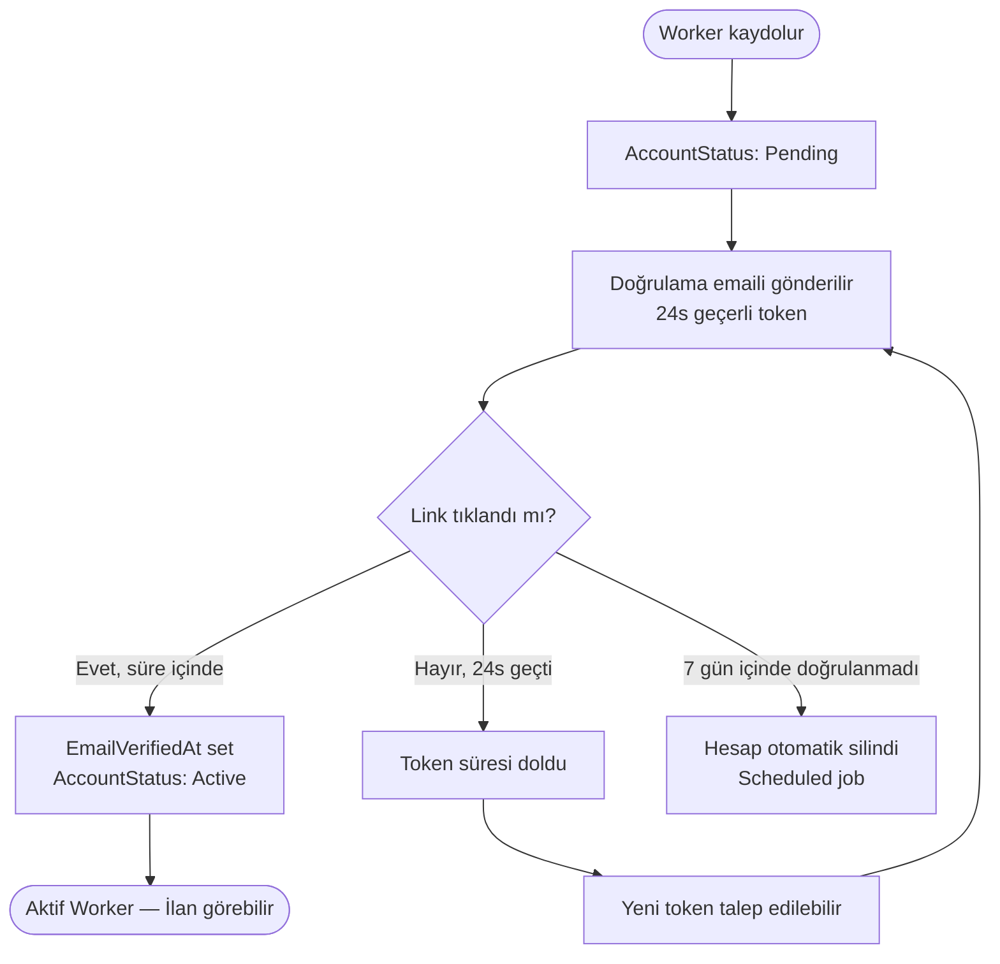

### 8.2 Multi-Device Session Akışı

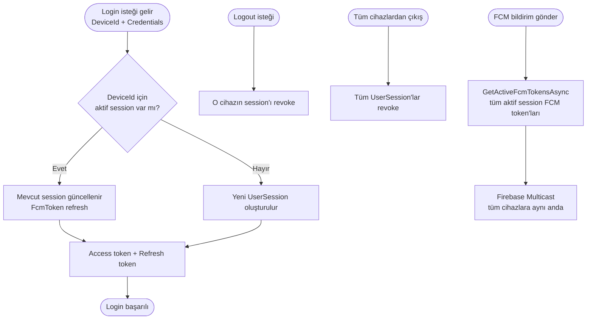

### 8.3 İlan → Semantic Matching → Agentic Bildirim

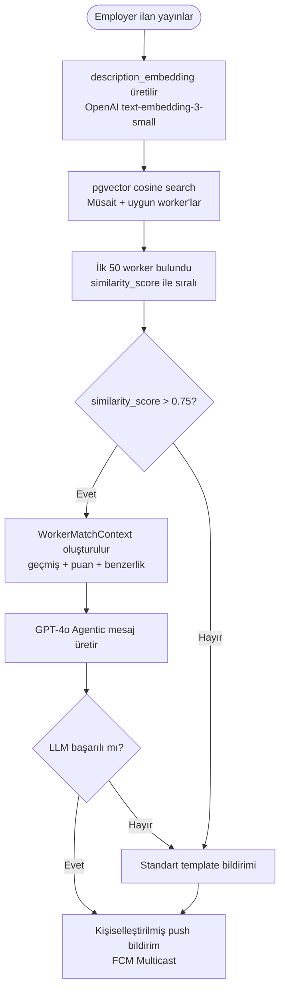

### 8.4 Mutual QR Check-in (Clock Drift + Grace Period)

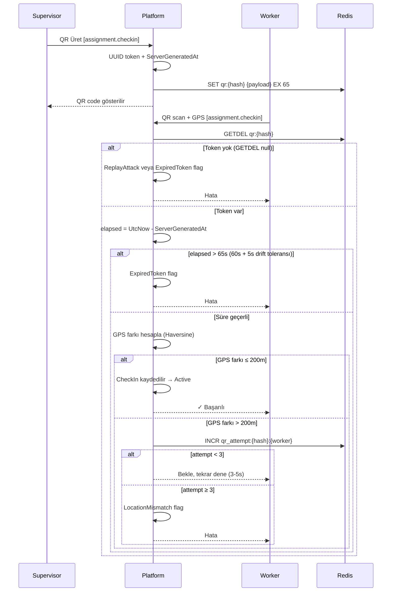

### 8.5 WorkerPayout Race Condition

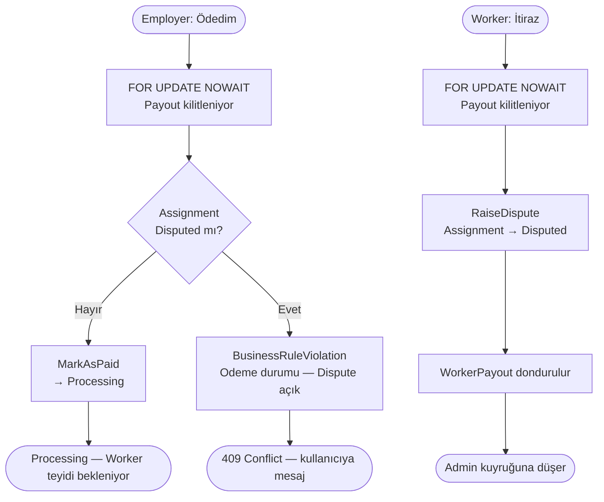

### 8.6 Komisyon ve Finansal Akış

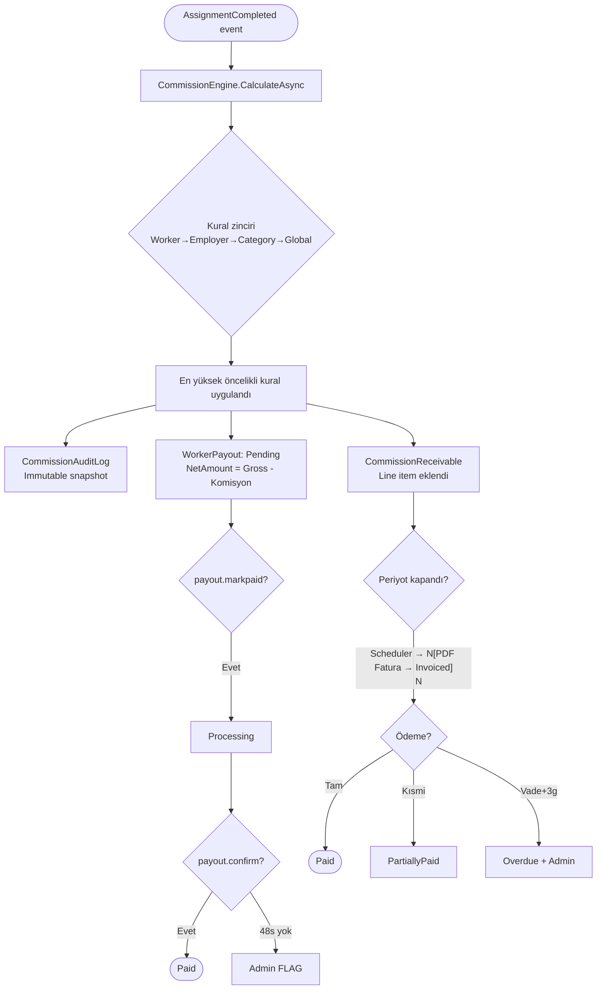

---

## 9. State Machine'ler

### 9.1 User / Worker Aktivasyon

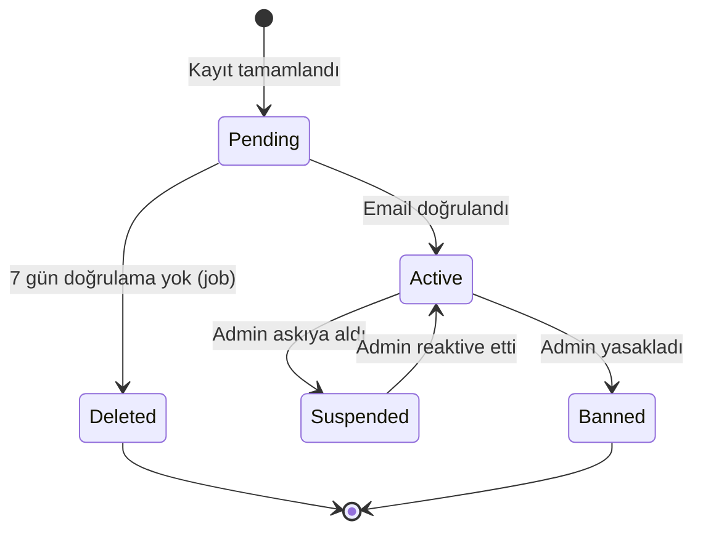

### 9.2 CvUploadSession

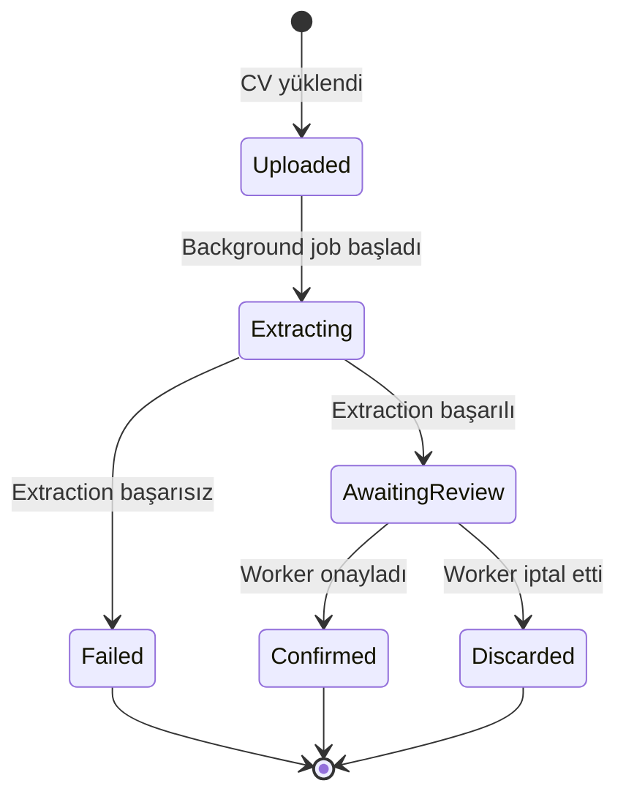

### 9.3 Assignment

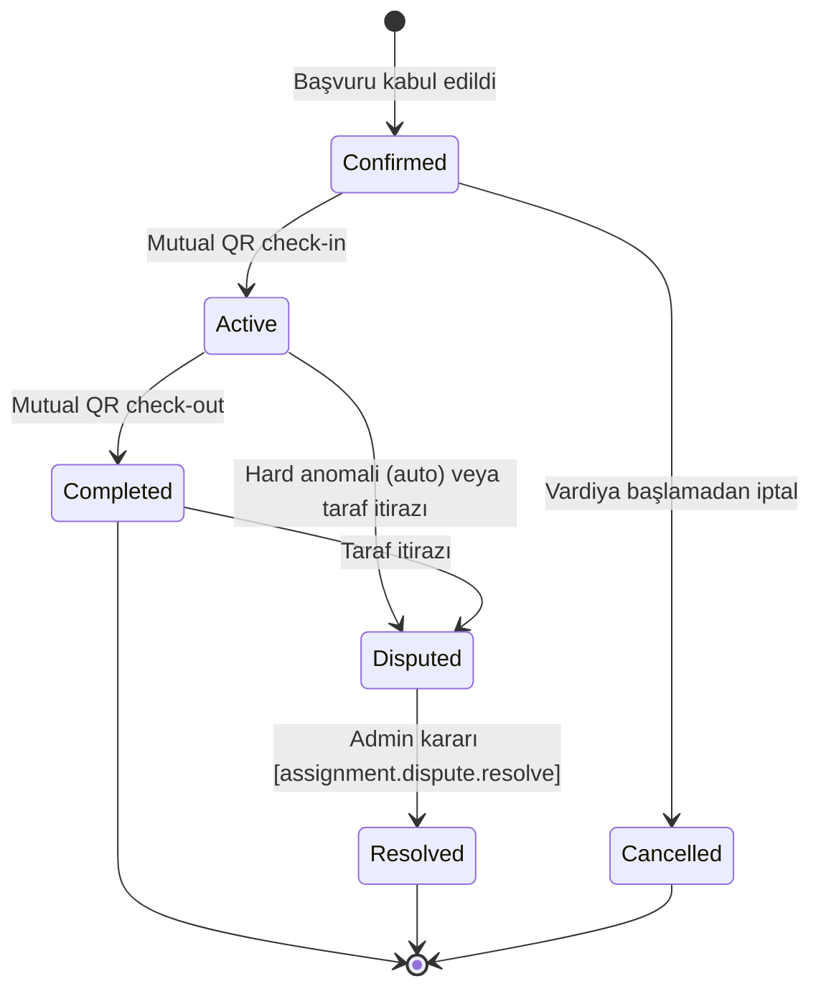

### 9.4 CommissionReceivable

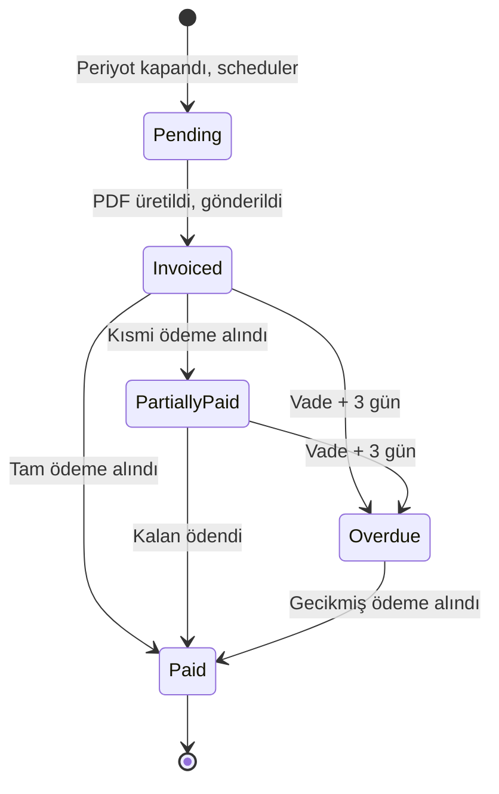

### 9.5 WorkerPayout

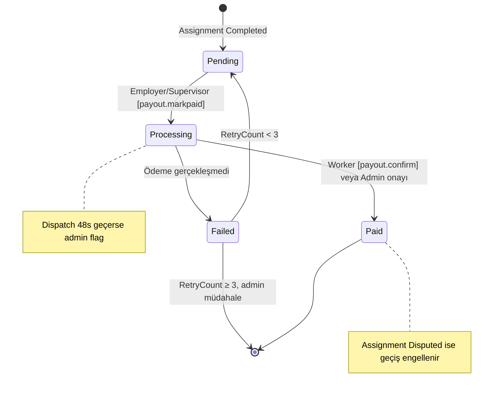

### 9.6 JobPosting

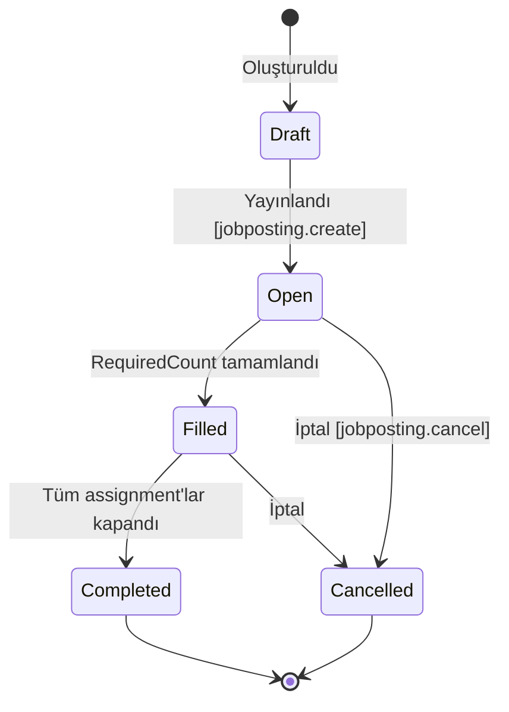

---

## 10. Fonksiyonel Olmayan Gereksinimler

### 10.1 Performans

| Gereksinim | Hedef | Notlar |
|------------|-------|--------|
| API yanıt süresi (p95) | < 300ms | Non-AI endpoint'ler |
| QR token üretim | < 100ms | Redis operasyonu dahil |
| Embedding üretim | < 2s | GPT-4o API çağrısı — async |
| PermissionResolver | < 10ms | Redis cache hit |
| Agentic bildirim üretim | < 5s | Async, bildirim geciktirilmez |
| pgvector semantic search | < 50ms | IVFFlat approximate index |
| Push notification (FCM) | < 2s | Multicast |
| Eşzamanlı kullanıcı | 1.000 aktif session | Başlangıç |
| Günlük assignment kapasitesi | 10.000 | |

### 10.2 Güvenlik

- HTTPS / TLS 1.3 zorunlu
- JWT RS256 (asymmetric) — access 15dk, refresh 30gün + rotation
- QR token: UUID + HMAC-SHA256, single-use via Redis GETDEL, 60s TTL
- GPS: sunucuda doğrulanır, clock drift toleransı: +5s
- AES-256-GCM: TaxNumber, IBAN, DocumentNumber at-rest encryption
- Rate limiting: login 10/dk, CV upload 3/saat, QR scan 60/dk
- Account lockout: 5 başarısız login → 15dk bekleme
- Permission cache invalidation: grup üyeliği değişince Redis key silinir
- OWASP Top 10 uyumlu geliştirme

### 10.3 Güvenilirlik

- Uptime hedefi: %99.5
- QR token Redis'te — distributed ortamda GETDEL atomik
- Embedding fallback: pgvector null ise keyword-based matching
- Agentic bildirim fallback: LLM hata → standart template
- Pessimistic lock: payout race condition için `FOR UPDATE NOWAIT`
- Veritabanı: günlük backup, point-in-time recovery

### 10.4 Ölçeklenebilirlik

- Modular Monolith başlangıç — cross-module: domain event veya public interface
- Stateless API — yatay ölçeklendirme hazır
- Embedding üretimi async background job — API thread'i bloklamamaz
- pgvector IVFFlat: `lists=100` ile ~10M worker'a kadar ölçeklenebilir
- Faz 2'de Assignment ve Commission modülleri önce microservice'e ayrılır

---

## 11. Sistem Mimarisi

### 11.1 Teknoloji Stack

| Katman | Teknoloji | Kullanım |
|--------|-----------|----------|
| Backend | .NET 10 (C#) | Core logic, API, SignalR, PermissionResolver |
| Web Frontend | TypeScript / Next.js | Admin panel, Employer web dashboard |
| Mobile | Flutter (Riverpod) | Worker App + Employer App — tek codebase, 2 flavor |
| Veritabanı | PostgreSQL 16 + pgvector | Ana veri + semantic search |
| Cache / Token | Redis | QR token, permission cache, rate limiting, grace period sayacı |
| Real-time | SignalR | Matching, vardiya doluluk, QR durum |
| Push | Firebase FCM | Flutter multicast push |
| Dosya | MinIO (S3-compatible) | CV, sertifikalar, fatura PDF |
| AI / LLM | OpenAI GPT-4o | CV extraction, agentic bildirim |
| Embedding | OpenAI text-embedding-3-small | Worker + posting semantic vector |
| Background Jobs | Hangfire (PostgreSQL) | CV extraction, fatura periyodu, embedding üretim |
| Container | Docker + Compose | Tüm servisler |

### 11.2 Modüler Mimari

```
Modules/
├── Identity/          ← Auth, email doğrulama, UserGroup, Permission, UserGroupMembership,
│                        UserSession (multi-device), PermissionResolver
├── WorkerProfile/     ← Profil, skill+embedding, eğitim, deneyim, sertifika, referans, dil,
│                        müsaitlik, rating, CvUploadSession, CvImportPreview
├── EmployerProfile/   ← İşveren, lokasyon/geofence, supervisor
├── JobPosting/        ← İlan+embedding, başvuru, şablon, JobCategory
├── Matching/          ← pgvector cosine search, müsaitlik filtresi, agentic bildirim
├── Assignment/        ← Görevlendirme, Mutual QR (clock drift + grace period), anomali
├── Commission/        ← Kural motoru, CommissionEngine, audit log
├── Billing/           ← CommissionReceivable, PDF fatura, sequence
├── Payout/            ← WorkerPayout (pessimistic lock), ödeme takibi
├── Notification/      ← Push (multicast), SMS, email, Outbox pattern
└── Reporting/         ← CQRS queries, export (CSV/PDF/Excel), snapshot
```

### 11.3 DI Interface'leri

| Interface | Default Implementation | Notlar |
|-----------|----------------------|--------|
| `ICvExtractionService` | `OpenAiCvExtractionService` | Swap edilebilir |
| `IDocumentReader` | `CompositeDocumentReader` | PDF + DOCX reader'lar |
| `IEmbeddingService` | `OpenAiEmbeddingService` | text-embedding-3-small |
| `IPersonalizedNotificationService` | `OpenAiPersonalizedNotificationService` | GPT-4o |
| `IPermissionResolver` | `PermissionResolver` | Redis cache |
| `IQrTokenStore` | `RedisQrTokenStore` | GETDEL atomic |
| `IFileStorageService` | `MinioFileStorageService` | Presigned URL |
| `IEmailService` | `SmtpEmailService` | MailKit |
| `IPushNotificationService` | `FcmPushNotificationService` | Firebase Admin SDK |
| `IInvoicePdfService` | `QuestPdfInvoiceService` | QuestPDF |

---

## 12. Domain Modeli

### 12.1 AggregateRoot'lar

| Entity | Namespace | Base Class | Notlar |
|--------|-----------|-----------|--------|
| `User` | Identity | `StatableEntityBase` | Email doğrulama + multi-device session |
| `UserGroup` | Identity | `StatableEntityBase` | Level, IsSystem, permissions |
| `Permission` | Identity | `AuditableEntityBase` | resource.action format |
| `UserGroupMembership` | Identity | `AuditableEntityBase` | Scope + aktiflik |
| `UserSession` | Identity | `EntityBase` | Multi-device, FCM token per device |
| `Worker` | WorkerProfile | `StatableEntityBase` | skill_embedding vector(1536) |
| `CvUploadSession` | WorkerProfile | `AuditableEntityBase` | Pipeline state machine |
| `Employer` | EmployerProfile | `StatableEntityBase` | |
| `JobCategory` | JobPosting | `CodedNamedEntityBase` | Runtime yönetilen |
| `JobPosting` | JobPosting | `AuditableEntityBase` | description_embedding vector(1536) |
| `JobPostingTemplate` | JobPosting | `AuditableEntityBase` | |
| `Assignment` | Assignment | `AuditableEntityBase` | AnomalyFlag bitmask |
| `CommissionRule` | Commission | `StatableEntityBase` | |
| `CommissionAuditLog` | Commission | `EntityBase` | Immutable, append-only |
| `CommissionReceivable` | Billing | `AuditableEntityBase` | |
| `WorkerPayout` | Payout | `AuditableEntityBase` | Pessimistic lock |
| `Notification` | Notification | `EntityBase` | Outbox pattern |
| `ReportingSnapshot` | Reporting | `EntityBase` | Faz 2 |

### 12.2 Child Entity'ler

| Entity | Parent | Notlar |
|--------|--------|--------|
| `RefreshToken` | User | SHA-256 hash |
| `GroupPermission` | UserGroup | Allow \| Deny |
| `WorkerSkill` | Worker | Lowercase tag |
| `WorkerEducation` | Worker | |
| `WorkerExperience` | Worker | |
| `WorkerCertificate` | Worker | CredentialId, opsiyonel belge URL |
| `WorkerReference` | Worker | Maks. 5 |
| `WorkerLanguage` | Worker | ISO 639-1, LanguageLevel |
| `WorkerAvailability` | Worker | TimeSlot value object |
| `WorkerRating` | Worker | 1–5, assignment başına 1 |
| `EmployerLocation` | Employer | GeoCoordinate, GeofenceRadiusMetres |
| `ShiftSupervisor` | Employer | AssignedLocationIds JSON array |
| `JobApplication` | JobPosting | Unique constraint (posting, worker, Pending) |
| `AssignmentCheckIn` | Assignment | QrTokenHash (SHA-256), DistanceMetres |
| `CommissionReceivableItem` | CommissionReceivable | WorkerNameSnapshot |
| `CommissionReceivablePayment` | CommissionReceivable | Partial payment |

### 12.3 Value Object'ler

| Value Object | Kullanım | Notlar |
|-------------|----------|--------|
| `Money` | Tüm finansal tutarlar | Amount + Currency (ISO 4217) |
| `GeoCoordinate` | Geofence, check-in doğrulama | Haversine DistanceTo() |
| `Address` | EmployerLocation | Owned entity |
| `DateRange` | Billing period | Start <= End invariant |
| `TimeSlot` | Vardiya saatleri | Start < End invariant |
| `WorkPermit` | Worker (opsiyonel) | Owned, encrypted DocumentNumber |
| `CommissionCalculationResult` | CommissionAuditLog | Immutable snapshot |
| `CvImportPreview` | CvUploadSession | JSONB, PreviewField<T> confidence wrapper |

### 12.4 Enum'lar

| Enum | Değerler | Notlar |
|------|----------|--------|
| `AccountStatus` | Pending(0) / Active / Suspended / Banned | UserRole kaldırıldı |
| `PermissionEffect` | Allow(0) / Deny | Deny her zaman kazanır |
| `MembershipScopeType` | Global / EmployerScoped / LocationScoped | |
| `WorkPermitStatus` | Uploaded / Verified / Rejected / Expired | Bilgilendirme amaçlı |
| `AssignmentStatus` | Confirmed / Active / Completed / Disputed / Resolved / Cancelled | |
| `AnomalyFlag` | `[Flags]` bitmask, 8 bit | None=0, …, SupervisorOffsite=128 |
| `DisputeReason` | WorkerNoShow / WorkerLeftEarly / EmployerDeniedEntry / WageDiscrepancy / FraudSuspicion | |
| `DisputeResolution` | FavoredWorker / FavoredEmployer / PartialPayout / Withdrawn | |
| `CommissionScope` | Global(0) / JobCategory / Employer / Worker(3) | |
| `CommissionType` | Percentage / FixedAmount | |
| `CommissionTarget` | Worker / Employer / Both | |
| `CommissionReceivableStatus` | Pending / Invoiced / PartiallyPaid / Paid / Overdue | |
| `WorkerPayoutStatus` | Pending / Processing / Paid / Failed | |
| `PaymentMethod` | Cash / BankTransfer / Other | |
| `CvSessionStatus` | Uploaded / Extracting / AwaitingReview / Confirmed / Discarded / Failed | |
| `CvFileFormat` | Pdf / Docx | |
| `ExtractionConfidence` | High / Medium / Low | |
| `LanguageLevel` | Beginner / Intermediate / Advanced / Native | |
| `EducationType` | HighSchool / AssociateDegree / BachelorDegree / MasterDegree / Doctorate / VocationalCourse / Other | |
| `ReferenceRelation` | FormerEmployer / AcademicAdvisor / Colleague / Other | |
| `NotificationChannel` | Push / Sms / Email / InApp | |
| `NotificationStatus` | Pending / Sent / Failed / Cancelled | |
| `JobPostingStatus` | Draft / Open / Filled / Completed / Cancelled | |
| `ApplicationStatus` | Pending / Accepted / Rejected / Withdrawn / Expired | |

### 12.5 Domain Event'ler

```
Identity
├── UserGroupCreatedEvent
├── UserGroupPermissionSetEvent
├── UserGroupMembershipCreatedEvent
├── UserGroupMembershipRevokedEvent
├── EmailVerificationRequestedEvent    ← YENİ v6.0
└── EmailVerifiedEvent                 ← YENİ v6.0

WorkerProfile
├── WorkerRegisteredEvent
├── WorkerApprovedEvent               (Employer için hâlâ geçerli)
├── WorkerAccountSuspendedEvent
├── WorkerWorkPermitAttachedEvent
├── WorkerProfileUpdatedEvent          ← YENİ v6.0 (embedding güncelleme trigger)
├── WorkerRatedEvent
├── CvUploadedEvent
├── CvExtractionCompletedEvent
├── CvExtractionFailedEvent
├── CvImportConfirmedEvent             ← embedding güncelleme trigger
└── CvImportDiscardedEvent

JobPosting
├── JobCategoryCreatedEvent
├── JobPostingPublishedEvent           ← embedding üretim + matching trigger
├── JobPostingFilledEvent
├── JobPostingCancelledEvent
├── JobApplicationSubmittedEvent
├── JobApplicationAcceptedEvent
└── JobApplicationRejectedEvent

Assignment
├── AssignmentCheckedInEvent
├── AssignmentCheckedOutEvent
├── AssignmentCompletedEvent           ← Commission + Payout tetikler
├── AssignmentCancelledEvent
├── AssignmentDisputeRaisedEvent
├── AssignmentDisputeResolvedEvent
└── AnomalyDetectedEvent

Commission / Billing / Payout
├── CommissionCalculatedEvent
├── CommissionReceivableCreatedEvent
├── InvoiceSentEvent
├── CommissionPaymentReceivedEvent
├── CommissionReceivableOverdueEvent
├── WorkerPayoutPendingEvent
├── WorkerPayoutMarkedAsPaidEvent
├── WorkerPayoutConfirmedEvent
└── WorkerPayoutFailedEvent
```

---

## 13. Raporlama Modülü

### 13.1 Mimari

CQRS — tüm raporlar read-side query handler'larıdır. Write-side'a dokunmaz.

| Strateji | Faz |
|----------|-----|
| Canlı OLTP sorgusu | Faz 1 — basit raporlar |
| Materialized Snapshot | Faz 2 — dashboard kartları, ağır sorgular |
| Read Replica | Faz 2 — raporlama sorguları write DB'yi etkilemez |

### 13.2 Rapor Kataloğu

| Grup | İzin | Raporlar |
|------|------|---------|
| Finansal | `report.financial.view` | Komisyon gelir özeti, alacak yaşlandırma, tahsilat performansı, kural etki analizi, worker ödeme durumu |
| Operasyonel | `report.operational.view` | Vardiya tamamlanma, no-show analizi, saat bazlı yoğunluk, doluluk oranı, anomali özeti |
| Worker performans | `report.operational.view` | Worker aktivite, güvenilirlik skoru, en aktif worker'lar, çalışma saati (izin limiti) |
| Worker kişisel | `report.worker.view` | Kazanç özeti, ödeme durumu, vardiya geçmişi |

### 13.3 ReportFilter

```csharp
record ReportFilter(
    DateTimeOffset?                  From,
    DateTimeOffset?                  To,
    ReportPeriodPreset?              Preset,
    long?                            EmployerId,
    long?                            WorkerId,
    long?                            LocationId,
    long?                            SupervisorId,
    string?                          JobCategoryCode,
    AssignmentStatus[]?              AssignmentStatuses,
    CommissionReceivableStatus[]?    ReceivableStatuses,
    WorkerPayoutStatus[]?            PayoutStatuses,
    ReportGroupBy?                   GroupBy,
    int                              Page = 1,
    int                              PageSize = 50,  // max 500
    string?                          SortBy,
    bool                             SortDescending = false,
    ExportFormat?                    ExportFormat);
```

### 13.4 Export

| Format | Özellikler |
|--------|-----------|
| JSON | Programatik erişim |
| CSV | UTF-8 BOM — Excel Türkçe uyumu |
| PDF | QuestPDF, digitally signed |
| Excel | ClosedXML, multi-sheet: Özet + Detay + Grafikler |

Büyük export'lar (> 1.000 satır) Hangfire job kuyruğuna alınır. Tamamlanınca FCM/email ile indirme linki gönderilir.

---

## 14. Geliştirme Yol Haritası

### Faz 1 — MVP (0–12 Hafta)

- Identity: kayıt, email doğrulama, JWT, multi-device session, UserGroup RBAC, PermissionResolver
- Migration: seed permissions, sistem grupları, admin kullanıcısı
- Worker profili: tüm bölümler + CV extraction pipeline
- Employer profili, lokasyon, supervisor
- JobCategory (entity) + seed data
- İlan oluşturma, başvuru akışı
- Komisyon motoru
- Mutual QR check-in/out (clock drift toleransı + grace period)
- CommissionReceivable + PDF fatura
- WorkerPayout (pessimistic lock)
- Flutter: Worker App + Employer App MVP
- Admin panel: temel yönetim + anomali kuyruğu

### Faz 2 — Intelligence & Automation (13–22 Hafta)

- pgvector extension + worker/posting embedding üretimi
- Semantic matching engine
- Agentic personalized notification
- Gerçek zamanlı eşleştirme (SignalR)
- Otomatik fatura döngüsü (Hangfire scheduler)
- OVERDUE alarm sistemi
- Permission cache (Redis) + invalidation
- Raporlama modülü (tüm handler'lar + export)
- ReportingSnapshot pre-aggregate altyapısı
- Embedding fallback mekanizması

### Faz 3 — Scale & Monetization (23+ Hafta)

- Employer abonelik modülü
- Value-added servisler
- Çok bölge / çok dil
- Microservices geçişi (Assignment + Commission önce)
- Read replica raporlama
- İleri analitik ve iş zekası
- Outbox pattern (InProcessEventDispatcher → outbox)

---

## 15. Riskler

| Risk | Etki | Azaltma |
|------|------|---------|
| GPS spoofing | Yüksek | Sunucu tarafı doğrulama, 3 deneme grace period, anomali pattern |
| QR replay attack | Yüksek | Redis GETDEL atomic — aynı token bir kez kullanılabilir |
| FilledCount overbooking | Yüksek | Atomic UPDATE + DB WHERE koşulu |
| Payout race condition | Yüksek | Pessimistic lock FOR UPDATE NOWAIT, Dispute önceliği |
| Duplicate fatura periyodu | Orta | Unique constraint + idempotent job |
| Stale embedding | Orta | Event-driven async üretim, keyword fallback |
| LLM servis kesintisi | Orta | Agentic bildirim fallback → standart template |
| Off-platform kaçış | Yüksek | Payout + komisyon platform kaydına bağlı |
| Email verification bypass | Orta | Token SHA-256 hash, 24s TTL, tek kullanımlık |
| Multi-device FCM token stale | Düşük | UserSession güncelleme her login'de |
| Clock drift (QR) | Orta | +5s server-side tolerans, ServerGeneratedAt payload'da |
| Chicken-and-egg | Düşük (önlendi) | Azoxia mevcut portföyüyle başlıyor |

---

## 16. Başarı Metrikleri (KPIs)

| Metrik | Hedef (İlk 6 Ay) |
|--------|-----------------|
| Aktif Worker | 1.000+ |
| Email doğrulama tamamlama oranı | %85+ |
| Aktif Employer | 100+ |
| Aylık tamamlanan vardiya | 5.000+ |
| Komisyon dijitalleşme oranı | %80 |
| Semantic matching precision@10 | %80+ (ilk 10 öneri içinde işveren onayı) |
| Agentic bildirim CTR | Standart template'e kıyasla +20% |
| CV import tamamlama oranı | %60+ (upload → confirm) |
| QR check-in başarı oranı | %95+ (anomalisiz) |
| Worker ödeme teyit oranı | %70+ |
| CommissionReceivable tahsilat oranı | %90+ |
| Ortalama eşleştirme süresi | < 30 dakika |
| No-show oranı | < %5 |
| Worker retention (30 gün) | %60+ |
| Race condition kaynaklı hata oranı | < %0.01 |

---

*Worbi Platform Gereksinimleri Dokümanı v6.0 — Azoxia · Şirket içi kullanım · Haziran 2025*
